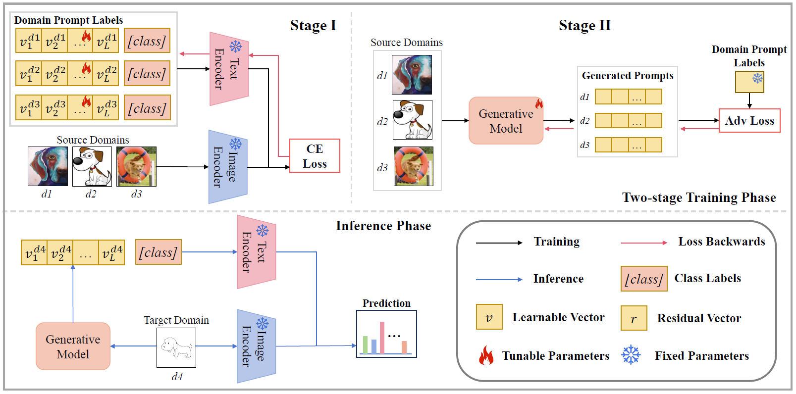

# Soft Prompt Generation [ECCV 2024]

[](https://paperswithcode.com/sota/domain-generalization-on-pacs-2?p=soft-prompt-generation-for-domain)
[](https://paperswithcode.com/sota/domain-generalization-on-vlcs?p=soft-prompt-generation-for-domain)
[](https://paperswithcode.com/sota/domain-generalization-on-office-home?p=soft-prompt-generation-for-domain)
[](https://paperswithcode.com/sota/domain-generalization-on-terraincognita?p=soft-prompt-generation-for-domain)
[](https://paperswithcode.com/sota/domain-generalization-on-domainnet?p=soft-prompt-generation-for-domain)

[](https://arxiv.org/abs/2404.19286v2)


Official implementation of the paper "[Soft Prompt Generation for Domain Generalization](https://arxiv.org/abs/2404.19286)".

Authors: [Shuanghao Bai*](https://scholar.google.com/citations?user=xhd94DIAAAAJ&hl=zh-CN), Yuedi Zhang*, [Wanqi Zhou](https://scholar.google.com/citations?user=3Q_3PR8AAAAJ&hl=zh-CN), [Zhirong Luan](https://scholar.google.com/citations?user=mJNCeucAAAAJ&hl=zh-CN), [Badong Chen](https://scholar.google.com/citations?user=mq6tPX4AAAAJ&hl=zh-CN&oi=ao).

<hr />

## 🎉 Highlights

<div align="center">
  
</div>

> **<p align="justify"> Abstract:** *Large pre-trained vision language models (VLMs) have shown impressive zero-shot ability on downstream tasks with manually designed prompt. To further adapt VLMs to downstream tasks, soft prompt is proposed to replace manually designed prompt, which undergoes finetuning based on specific domain data. Prior prompt learning methods primarily learn a fixed prompt or residuled prompt from training samples. However, the learned prompts lack diversity and ignore information about unseen domains. In this paper, we reframe the prompt learning framework from a generative perspective and propose a simple yet efficient method for the Domain Generalization (DG) task, namely Soft Prompt Generation (SPG). Specifically, SPG consists of a two-stage training phase and an inference phase. During the training phase, we introduce soft prompt label for each domain, aiming to incorporate the generative model domain knowledge. During the inference phase, the generator of the generative model is employed to obtain instance-specific soft prompts for the unseen target domain. Extensive experiments on five domain generalization benchmarks of three DG tasks demonstrate that SPG achieves state-of-the-art performance.* </p>

<details>
  
<summary>Main Contributions</summary>

1) To the best of our knowledge, we are the first to introduce the generative model into prompt learning in VLMs. Then, we propose a new paradigm of prompt tuning, namely Soft Prompt Generation (SPG).
2) We design a two-stage training phase to align the generative model with domain prompt labels. It incorporates domain knowledge into the generated prompts, enhancing the transferability across unseen domains.
3) Extensive experiments on five datasets for three DG tasks demonstrate that the proposed SPG achieves state-of-the-art performance
   
</details>


## 🛠️ Installation 
For installation and other package requirements, please follow the instructions as follows. 
This codebase is tested on Ubuntu 20.04 LTS with python 3.8. Follow the below steps to create environment and install dependencies.

* Setup conda environment.
```bash
# Create a conda environment
conda create -y -n spg python=3.8

# Activate the environment
conda activate spg

# Install torch (requires version >= 1.8.1) and torchvision
# Please refer to https://pytorch.org/get-started/previous-versions/ if your cuda version is different
conda install pytorch==2.0.0 torchvision==0.15.0 torchaudio==2.0.0 pytorch-cuda=11.8 -c pytorch -c nvidia
```

* Install dassl library.
```bash
# Instructions borrowed from https://github.com/KaiyangZhou/Dassl.pytorch#installation

# Clone this repo
git clone https://github.com/KaiyangZhou/Dassl.pytorch.git
cd Dassl.pytorch

# Install dependencies
pip install -r requirements.txt

# Install this library (no need to re-build if the source code is modified)
python setup.py develop
cd ..
```

* Clone SPG code repository and install requirements.
```bash
# Clone SPG code base
git clone https://github.com/renytek13/Soft-Prompt-Generation.git
cd Soft-Prompt-Generation

# Install requirements
pip install -r requirements.txt
```


## 📁 Data Preparation
**Please download the datasets `PACS`, `VLCS`, `office_home`, `terra_incognita`, and `domainnet`.**

Follow [DATASETS.md](DATASETS.md) to install the datasets.


## 📈 Training and Evaluation

We provide the running scripts in `scripts`, which allow you to reproduce the results on the paper. 
Make sure you **modify the path in `$DATA`**!

### Training Stage I: Domain Prompt Labels Learning (Optional)

If you wanna use our produced [data splits](datasets) and [domain prompt labels](prompt_labels). Please go to the [Training Stage II: Generative Model Pre-training](#training-stage-II-generative-model-pre-training)

<details>
  
<summary>If you wanna use the data splits and domain prompt labels produced by yourself. Please follow the instructions below.</summary>

To obtain data splits and domain prompt labels, please run the bash file in [scripts folder](scripts/spg_coop) as follows.

```bash
# Example: trains on PACS dataset with ResNet50 as the backbone, and the gpu id is 0. 
bash scripts/spg_coop/spg_coop.sh pacs RN50 0
```

</details>


### Training Stage II: Generative Model Pre-training
Please refer to [DATASETS.md](DATASETS.md), and make sure that our produced [data splits](datasets) are in your data path. The bash files of Three types of DG tasks in [scripts folder](scripts/spg_cgan).

For multi-source Domain Generalization
```bash
# Example: trains on PACS dataset with ResNet50 as the backbone, and the gpu id is 0. 
bash scripts/spg_cgan/spg_cgan.sh pacs spg RN50 0
```

For Single-source Domain Generation
```bash
# Example: trains on VLCS dataset with ResNet50 as the backbone, and the gpu id is 1. 
bash scripts/spg_cgan/single.sh vlcs spg RN50 1
```

For Cross-dataset Domain Generation
```bash
# Example: trains on DomainNet dataset with ViT-B/16 as the backbone, and the gpu id is 2. 
bash scripts/spg_cgan/cross.sh spg ViT-B/16 2
```


### Evaluation
For multi-source Domain Generalization
```bash
# Example: test PACS dataset with ResNet50 as the backbone, and the gpu id is 0. 
bash scripts/test_all.sh pacs spg RN50 0
```


## 📊 Supported Methods
Supported methods in this codespace are as follows:

| Method                    |                   Paper                        |                             Code                                     |
|---------------------------|:----------------------------------------------:|:--------------------------------------------------------------------:|
| CoOp                      | [IJCV 2022](https://arxiv.org/abs/2109.01134)  |  [link](https://github.com/KaiyangZhou/CoOp)                         |
| CoCoOp                    | [CVPR 2022](https://arxiv.org/abs/2203.05557)  |  [link](https://github.com/KaiyangZhou/CoOp)                         |
| VP                        | [-](https://arxiv.org/abs/2203.17274)          |  [link](https://github.com/hjbahng/visual_prompting)                 | 
| VPT                       | [ECCV 2022](https://arxiv.org/abs/2203.17274)  |  [link](https://github.com/KMnP/vpt)                                 | 
| MaPLe                     | [CVPR 2023](https://arxiv.org/abs/2210.03117)  |  [link](https://github.com/muzairkhattak/multimodal-prompt-learning) | 
| DPL                       | [TJSAI 2023](https://arxiv.org/abs/2111.12853) |  [link](https://github.com/shogi880/DPLCLIP)                         |


## 📝 Citation

If our code is helpful to your research or projects, please consider citing our work! 🥰 

```bibtex
@inproceedings{bai2024soft,
  title={Soft Prompt Generation for Domain Generalization},
  author={Bai, Shuanghao and Zhang, Yuedi and Zhou, Wanqi and Luan, Zhirong and Chen, Badong},
  booktitle={European Conference on Computer Vision},
  year={2024}
}
```

## 📨 Contact

If you have any questions, please create an issue on this repository or contact us at baishuanghao@stu.xjtu.edu.cn or zyd993@stu.xjtu.edu.cn.


## 🙏 Acknowledgements

Our code is based on [CoOp and CoCoOp](https://github.com/KaiyangZhou/CoOp), [MaPLe](https://github.com/muzairkhattak/multimodal-prompt-learning), and [PDA](https://github.com/BaiShuanghao/Prompt-based-Distribution-Alignment) repository. We thank the authors for releasing their codes. If you use their codes, please consider citing these works as well. 
